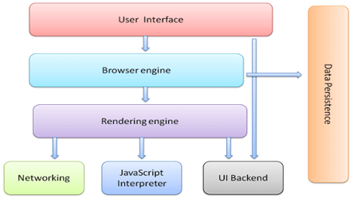

# Browsers and their working mechanisms

Browsers are one of the most widely used applications. Through its graphical user interface, a browser lets users access and display web pages or other online content. Chrome, Safari, and Opera are some examples of desktop browsers whereas Android Browser, iPhone, and UC Browser are examples of mobile browsers.

Browsers are responsible for presenting the web resources such as web pages, pdf, videos, and other files that one chooses by requesting them from the server. Learning the internal operation of the browser helps to make better decisions with the justifications behind the development of best practices.

> Chrome usage is higher worldwide as per [StatCounter statistics](http://gs.statcounter.com/) (as of Jan 2023).

Fig: Browser Components

The browser's main components are listed below.

1. **The User Interface**: Users interact with the browser through the user interface. Address bar, back and next buttons, home button, refresh and stop, and bookmark option are some of the examples through which they can interact. Here, things that are displayed in the browser except for the window where the requested page is displayed come under it.
2. **The Browser Engine**: It acts as a bridge between User Interface and Rendering Engine and communicates with the Data Storage Component. In response to inputs from various user interfaces, it queries and manipulates the rendering engine and stores data in Data Storage.
3. **The Rendering Engine:** It is responsible for displaying requested content. The requested content may vary depending on the data types and require plugins. For HTML content, it parses HTML and CSS, and displays the parsed content on the screen.
4. **Networking:** It is responsible for handling network tasks such as HTTP requests, Web Sockets, and Web RTC (Uses Real-Time Transport Protocol, which uses UDP). This component may implement a cache of retrieved documents in order to reduce network traffic.
5. **UI Backend:** It is used for drawing basic widgets like combo boxes and windows. This backend exposes a generic interface that is not platform specific and uses operating system user interface methods.
6. **JavaScript Interpreter:** This component interprets and executes the javascript code. After interpretation results are sent to the rendering engine. For external script, it first fetches the resource from the network and holds the parser until the script is executed.
7. **Data Storage:** This is a persistence layer and is used for storing cookies, cache, bookmarks, and preferences through storage mechanisms such as localStorage, IndexedDB, WebSQL, and FileSystem.

